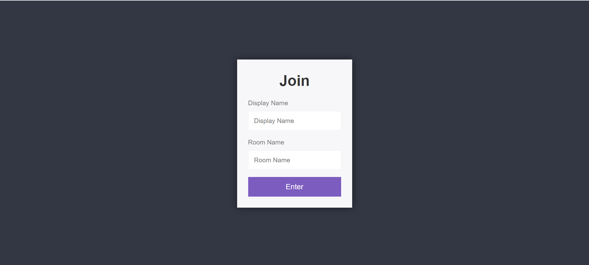
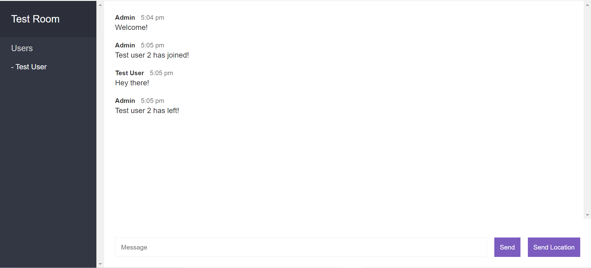

# Chat Application
> Real time chat application made using Nodejs and Websockets

## Screenshots



## Technologies
* Node.js

## Setup
To run this project, install it locally using npm:

```
$ cd ../<YOUR_DIRECTORY>
$ npm install
$ npm start
```

## Demo
Link for a working demo : https://rs-node-chat-app.herokuapp.com/
